### 一、概述

I/O设备就是可以将数据输入到计算机，或者可以接收计算机输出数据的外部设备，属于计算机中的硬件部件。键盘 鼠标 显示器 移动硬盘 都是I/O设备。

UNIX系统将外部设备抽象为一种特殊的文件，用户可以使用与文件操作相同的方式对外部设备进行操作。

- Write操作：向外部设备写出数据。

- Read操作：从外部设备读入数据。

1.I/O设备分类

按使用特性分类：
- 人机交互类外部设备：数据传输速度较快 鼠标 键盘 打印机。

- 存储设备：数据传输速率较快 移动硬盘光盘等。

- 网络通信设备：数据传输速率在两者之间 调制解调器。

按照传输速度分类：
- 低速设备:鼠标、键盘等------传输速率为每秒几个到几百字节

- 中速设备:如激光打印机等-------传输速率为每秒数千至上万个字节

- 高速设备:如磁盘等-------传输速率为每秒数千字节至千兆字节的设备

按照信息交换的单位分类：
- 块设备:如磁盘等-------数据传输的基本单位是块

- 字符设备:鼠标、键盘等-------数据传输的基本单位是字符

### 二、IO控制器

1.I/0设备的机械部件：

I/O设备的机械部件主要用来执行具体I/0操作。
如我们看得见摸得着的鼠标/键盘的按钮; 显示器的LED屏; 移动硬盘的磁臂、磁盘盘面。

2.I/0设备的电子部件(I/0控制器)： 

CPU无法直接控制I/O设备的机械部件，因此I/0设 备还要有一个电子部件作为CPU和I/O设备机械部件之间的中介，用于实现CPU对设备的控制。

- 如CPU发来的read/write命令，I/O控制器中会有相应的控制寄存器先来存放命令和参数。
- I/0控制器中会有相应的状态寄存器，用于记录I/O设备的当前状态。如: 1表示空闲，0表示忙碌。
- I/0控制器中会设置相应的数据寄存器。输出时，数据寄存器用于暂存CPU发来的数据，之后再由控制器传送设备。输入时，数据寄存器用于暂存设备发来的数据，之后CPU从数据寄存器中取走数据。
- 类似于内存的地址，为了区分设备控制器中的各个寄存器，也需要给各个寄存器设置一个特定的“地址”。I/O控制器通过CPU提供的“地址”来判断CPU要读/写的是哪个寄存器。

3.I/O控制器的组成：

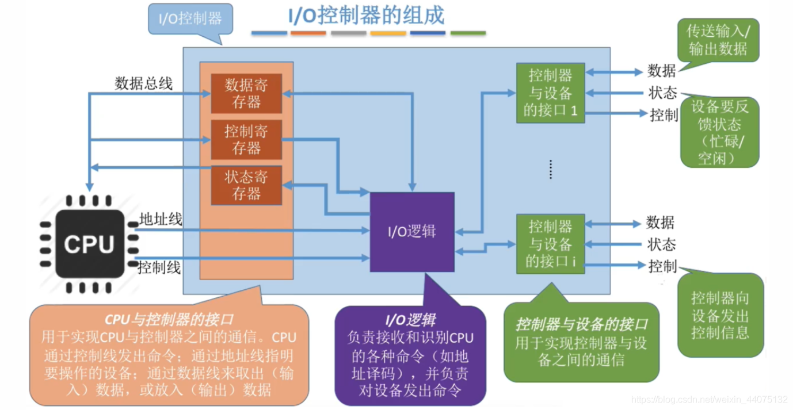

I/O逻辑负责接收和识别CPU的各种命令( 如地址译码)，并负责对设备发出命令。

注：一个I/O控制器可能会对应多个设备，数据寄存器、控制寄存器、状态寄存器可能有多个(如:每个控制/状态寄存器对应一个具体的设备)，且这些寄存器都要有相应的地址，才能方便CPU操作。

有的计算机会让这些寄存器占用内存地址的一部分， 称为内存映像I/O;

另一些计算机则采用I/O专用地址，即寄存器独立编址。

4.内存映像I/O和寄存器独立编制

### 三、I/O控制方式

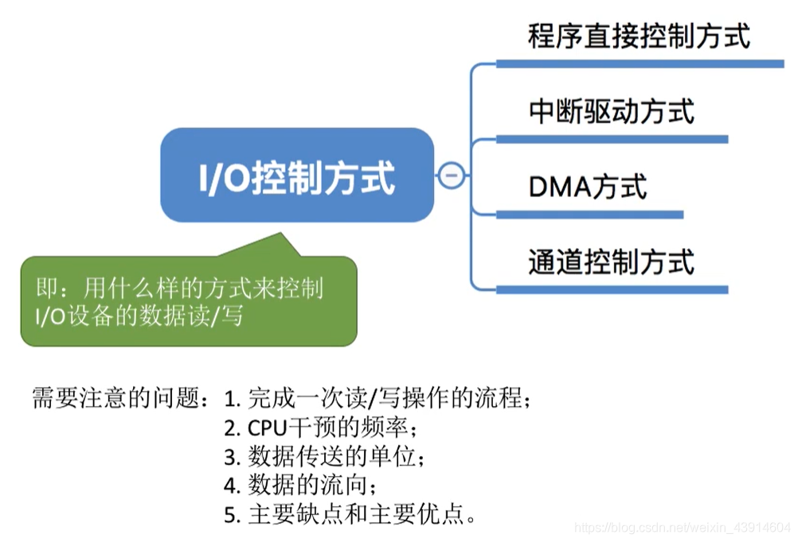

1.程序直接控制方式

轮询流程图：
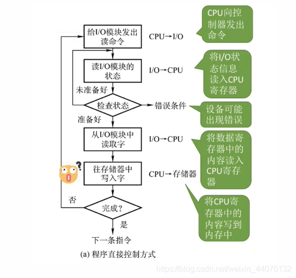

- CPU干预很频繁，I/O操作开始之前、完成之后需要CPU介入，并且在等待I/0完成的过程中CPU需要不断地轮询检查。

- 数据传送的单位每次读/写一个字

- 数据的流向：读操作(数据输入):I/0设备 → CPU → 内存，写操作(数据输出):内存 → CPU → l/O设备，CPU指的是CPU的寄存器，每个字的读取都需要CPU的帮助。

优点:实现简单。在读/写指令之后，加上实现循环检查的一系列指令即可( 因此才称为“程序直接控制方式”)。

缺点: CPU和I/O设 备只能串行工作，CPU需要一直轮询检查,长期处于“忙等”状态，CPU利用率低。

2.中断驱动方式

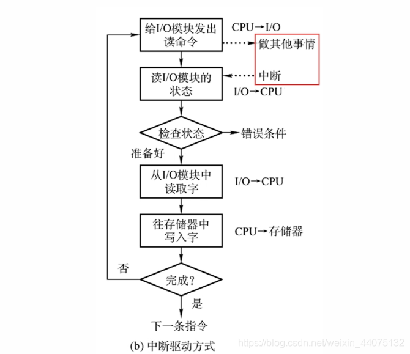

引入中断机制。由于I/O设 备速度很慢，因此在CPU发出读/写命令后，可将等待I/O的进程阻塞，先切换到别的进程执行。
当I/O完成后，控制器会向CPU发出一个中断信号，CPU检测到中断信号后，会保存当前进程的运行环境信息，转去执行中断处理程序处理该中断。
处理中断的过程中，CPU从I/O控制器读一个字的数据传送到CPU寄存器，再写入主存。接着，CPU恢复等待I/O的进程(或其他进程)的运行环境，然后继续执行。

- CPU会在每个指令周期的末尾检查中断。

- 中断处理过程中需要保存、恢复进程的运行环境，这个过程是需要-定时间开销的。可见，如果中断发生的频率太高，也会降低系统性能。

- 每次I/O操作开始之前、完成之后需要CPU介入。等待I/O完成的过程中CPU可以切换到别的进程执行。

- 数据传送的单位每次读/写一个字。

优点:与“程序直接控制方式”相比，在“中断驱动方式”中，I/O控制器会通过中断信号主动报告l/O已完成，CPU不再需要不停地轮询。CPU和I/O设备可并行工作，CPU利用率得到明显提升。

缺点:每个字在I/O设备与内存之间的传输，都需要经过CPU。而频繁的中断处理会消耗较多的CPU时间。

3.DMA方式
与中断驱动方式相比，DMA方式 ( Direct Memory Access，直接存储器存取。主要用于块设备的I/O控制) 有这样几个改进:

- 数据的传送单位是“块”。不再是一个字、一个字的传送。
- 数据的流向是从设备直接放入内存，或者从内存直接到设备。不再需要CPU中转。
- 仅在传送一个或多个数据块的开始和结束时，才需要CPU干预。

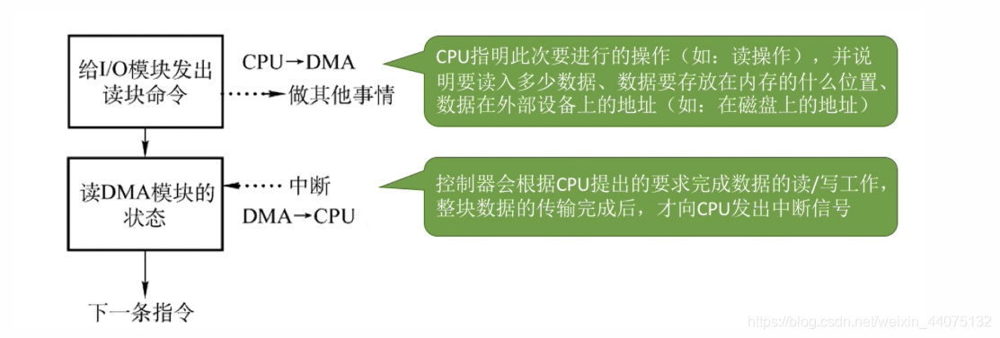

DMA控制器：

- DR(Data Register，数据寄存器):暂存从设备到内存，或从内存到设备的数据。

- MAR(Memory Address Register，内存地址寄存器):在输入时，MAR表示数据应放到内存中的什么位置;输出时MAR表示要输出的数据放在内存中的什么位置。

- DC(Data Counter，数据计数器):表示剩余要读/写的字节数。

- CR(Command Register，命令/状态寄存器):用于存放CPU发来的I/0命令，或设备的状态信息。

优点:数据传输以“块”为单位，CPU介入频率进一步降低。数据的传输不再需要先经过CPU再写入内存，数据传输效率进一步增加。CPU和I/O设备的并行性得到提升。

缺点:CPU每发出一条I/O指令，只能读/写一个或多个连续的数据块。

4.通道控制方式

通道: 一种硬件，可以理解为是弱化版的CPU。通道可以识别并执行一系列通道指令。

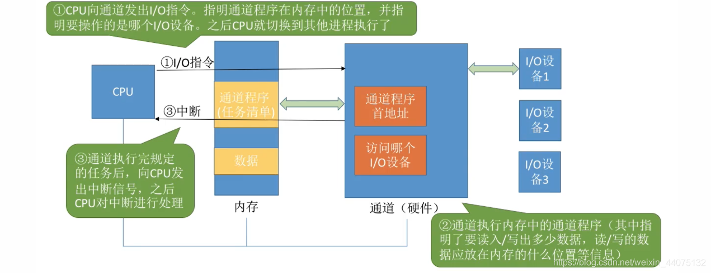

与CPU相比，通道可以执行的指令很单一，并且通道程序是放在主机内存中的，也就是说通道与CPU共享内存。

- CPU干预的频率极低，通道会根据CPU的指示执行相应的通道程序，只有完成一组数据块的读/写后才需要发出中断信号，请求CPU干预。

- 数据传送的单位，每次读/写一组数据块

优点: CPU、 通道、I/O设备可并行工作，资源利用率很高。

缺点:实现复杂，需要专门的通道硬件支持。

### 四、IO软件层次

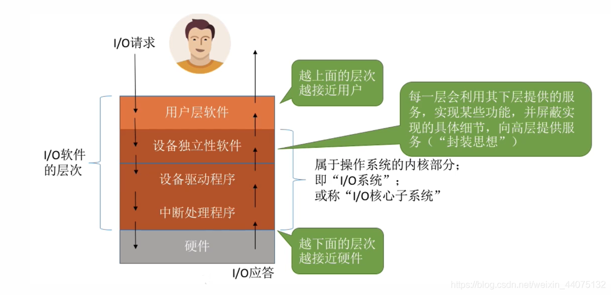

1.用户层软件

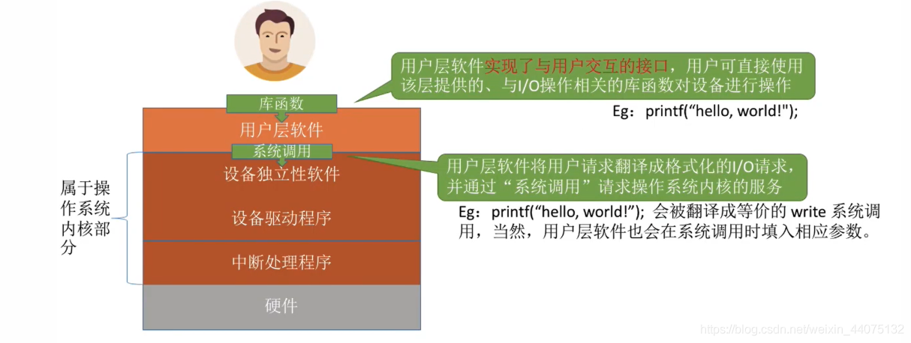
Windows操作系统向外提供的一系列系统调用，但是由于系统调用的格式严格，使用麻烦，因此在用户层上封装了一系列更方便的库函数接口供用户使用(Windows API)。

2.设备独立性软件

设备独立性软件，又称设备无关性软件。与设备的硬件特性无关的功能几乎都在这一层实现。

- 向上层提供统一的调用接口(如read/write系统调用)。

- 设备的保护，权限等。

- 差错处理。

- 设备的分配与回收。

- 数据缓冲区管理，可以通过缓冲技术屏蔽设备之间数据交换单位大小和传输速度的差异。

- 建立逻辑设备名到物理设备名的映射关系，根据设备类型选择调用相应的驱动程序I/O核心子系统。设备独立性软件需要通过逻辑设备表(LUT, Logical Unit Table)来确定逻辑设备对应的物理设备，并找到该设备对应的设备驱动程序。
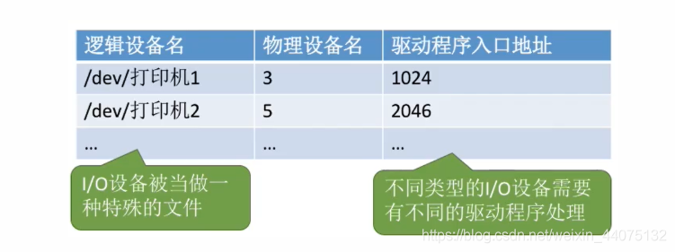

3.设备驱动程序

主要负责对硬件设备的具体控制，将上层发出的一系列命令(如read/write)转化成特定设备“能听得懂”的一系列操作。包括设置设备寄存器，检查设备状态等。

一般驱动程序一般会以一个独立进程的方式存在。

不同设备的内部硬件特性也不同，这些特性只有厂家才知道，因此厂家须提供与设备相对应的驱动程序，CPU执行驱动程序的指令序列，来完成设置设备寄存器，检查设备状态等工作。

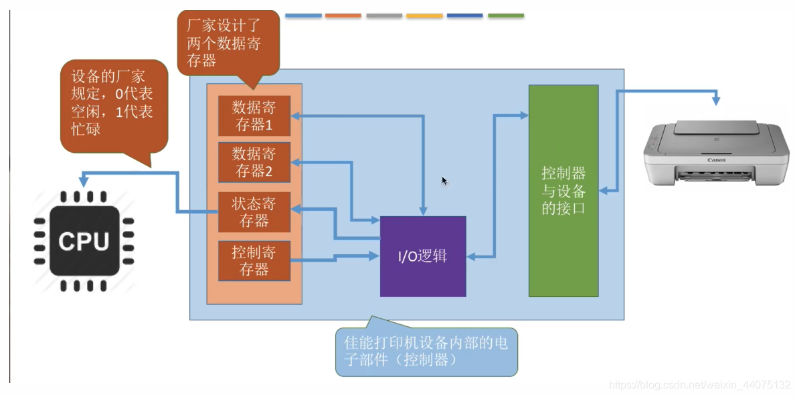

4.中断处理程序

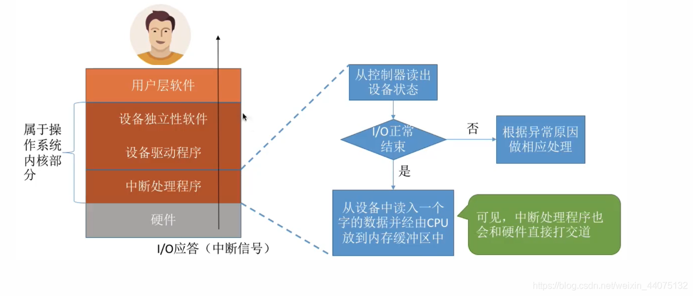

### 五、I/O核心子系统

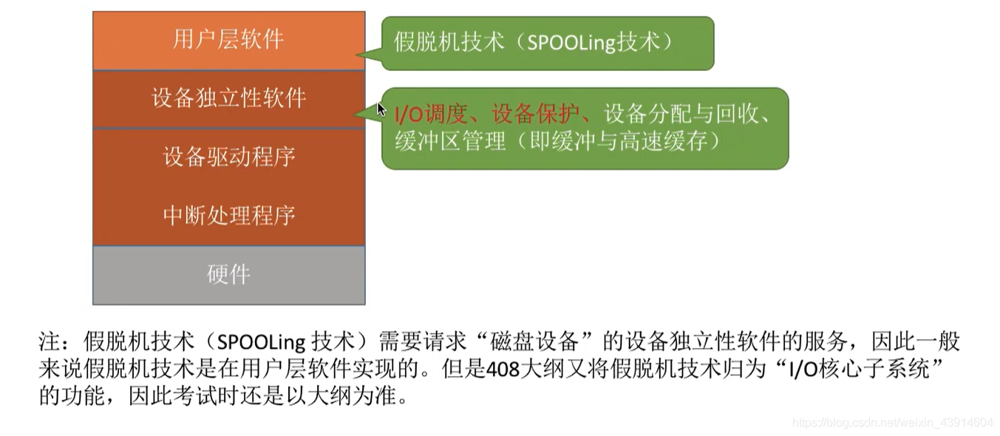

- IO调度：某种算法确定一个顺序来处理各个IO请求。
- 设备保护：设备被看做一种特殊的文件，不同的用户对不同的设备有不同权限。

1.假脱机技术(SPOOLing)

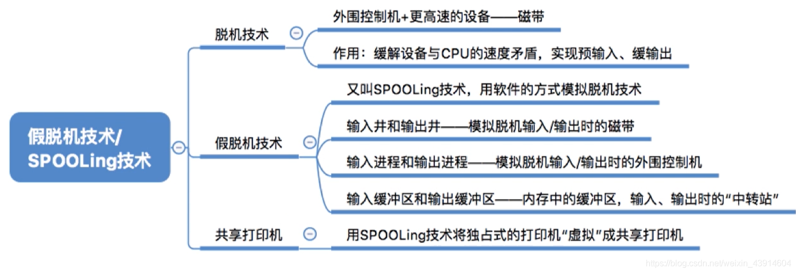

因为手工阶段的速度慢问题，引入了脱机技术。

Tips:为什么称为脱机一脱离主机的控制进行的输入/输出操作。

引入脱机技术后，缓解了CPU与慢速I/O设备的速度矛盾。另一方面，即使CPU在忙碌，也可以提前将数据输入到磁带，即使慢速的输出设备正在忙碌，也可以提前将数据输出到磁带。

假脱机技术：用软件模拟脱机技术。

输入井 输出井：
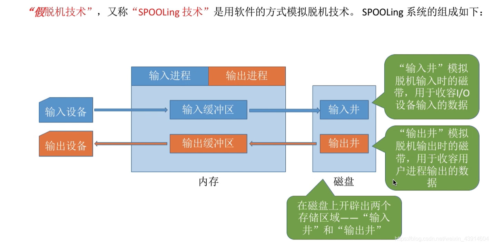

输入进程 输出进程：
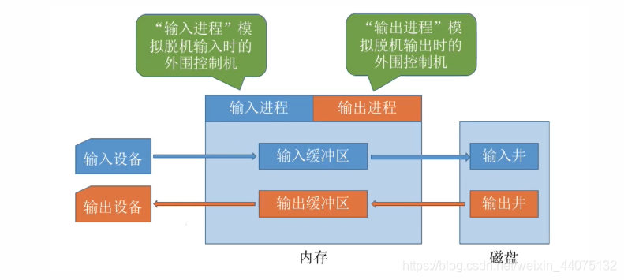

- 在输入进程的控制下，输入缓冲区用于暂存从输入设备输入的数据，之后再转存到输入井中。
- 在输出进程的控制下，输出缓冲区用于暂存从输出井送来的数据，之后再传送到输出设备上。

例：共享打印机原理

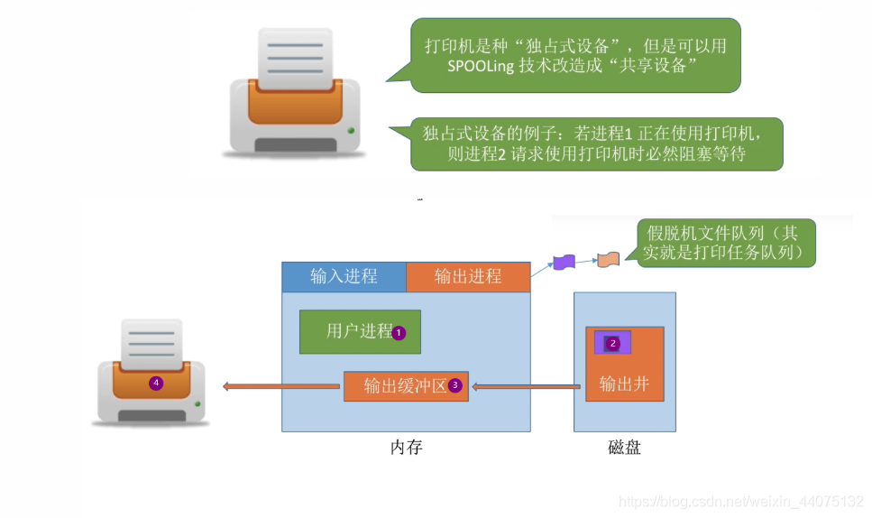

当多个用户进程提出输出打印的请求时，系统会答应它们的请求，但是并不是真正把打印机分配给他们，而是由假脱机管理进程为每个进程做两件事:

- 在磁盘输出井中为进程申请一个空闲缓冲区(也就是说，这个缓冲区是在磁盘上的)，并将要打印的数据送入其中。

- 为用户进程申请一张空白的打印请求表，并将用户的打印请求填入表中(其实就是用来说明用户的打印数据存放位置等信息的)，再将该表挂到假脱机文件队列上。
  当打印机空闲时，输出进程会从文件队列的队头取出一张打印请求表，并根据表中的要求将要打印的数据从输出井传送到输出缓冲区，再输出到打印机进行打印。用这种方式可依次处理完全部的打印任务。

### 六、设备的分配与回收

1.设备的固有属性

- 独占设备：一个时段只能分配给一个进程( 如打印机)
- 共享设备：可同时分配给多个进程使用(如磁盘)，各进程往往是宏观上同时共享使用设备，而微观上交替使用。
- 虚拟设备：-采用SPOOLing技术将独占设备改造成虚拟的共享设备，可同时分配给多个进程使用(如采用SPOOLing技术实现的共享打印机)

2.设备的分配算法

- 先来先服务
- 优先级高者优先
- 短任务优先

3.设备分配安全性

- 安全分配方式:为进程分配一个设备后就将进程阻塞，本次I/0完成后才将进程唤醒。
- 不安全分配方式:进程发出I/O请求后，系统为其分配I/0设备，进程可继续执行，之后还可以发出新的I/0请求。只有某个I/O请求得不到满足时才将进程阻塞。

4.静态分配和动态分配

- 静态分配:进程运行前为其分配全部所需资源，运行结束后归还资源，由于破坏了“请求和保持”条件，不会发生死锁。
- 动态分配:进程运行过程中动态申请设备资源

5.设备分配管理中的数据结构

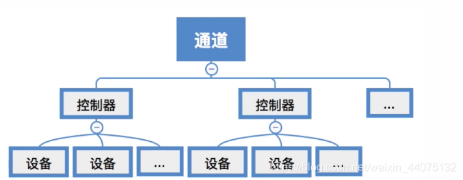

一个通道可控制多个设备控制器，每个设备控制器可控制多个设备。

- 设备控制表(DCT) :系统为每个设备配置一张DCT，用于记录设备情况。

系统会根据阻塞原因不同，将进程PCB挂到不同的阻塞队列中。

- 控制器控制表(COCT) :每个设备控制器都会对应一张COCT。操作系统根据COCT的信息对控制器进行操作和管理。

- 通道控制表(CHCT) :每个通道都会对应一张CHCT。操作系统根据CHCT的信息对通道进行操作和管理。

- 系统设备表(SDT) :记录了系统中全部设备的情况，每个设备对应一个表目。

6.分配过程 

- 根据进程请求的逻辑设备名查找SDT (注:用户编程时提供的逻辑设备名其实就是设备类型)。
- 查找SDT，找到用户进程指定类型的、并且空闲的设备，将其分配给该进程。操作系统在逻辑设备表(LUT)中新增一个表项。
- 根据DCT找到COCT，若控制器忙碌则将进程PCB挂到控制器等待队列中，不忙碌则将控制器分配给进程。
- 根据COCT找到CHCT,若通道忙碌则将进程PCB挂到通道等待队列中，不忙碌则将通道分配给进程。

### 七、缓冲区管理

缓冲区是一个存储区域，可以由专门的硬件寄存器组成，也可利用内存作为缓冲区。

使用硬件作为缓冲区的成本较高，容量也较小，一般仅用在对速度要求非常高的场合(如存储器管理中所用的联想寄存器，由于对页表的访问频率极高，因此使用速度很快的联想寄存器来存放页表项的副本)

一般情况下，更多的是利用内存作为缓冲区，设备独立性软件 的缓冲区管理就是要组织管理好这些缓冲区。

1.缓冲区的作用

- 缓和CPU和IO速度不匹配的矛盾。
- 减少对CPU的中断频率，放宽对CPU中断响应时间的限制。
- 解决数据颗粒度不匹配的问题。
- 提高CPU和IO的并行能力。

2.单缓冲

假设某用户进程请求某种块设备读入若干块的数据。若采用单缓冲的策略，操作系统会在主存中为其分配一个缓冲区。

注意:当缓冲区数据非空时，不能往缓冲区冲入数据，只能从缓冲区把数据传出;当缓冲区为空时,可以往缓冲区冲入数据，但必须把缓冲区充满以后，才能从缓冲区把数据传出。

- T > C时

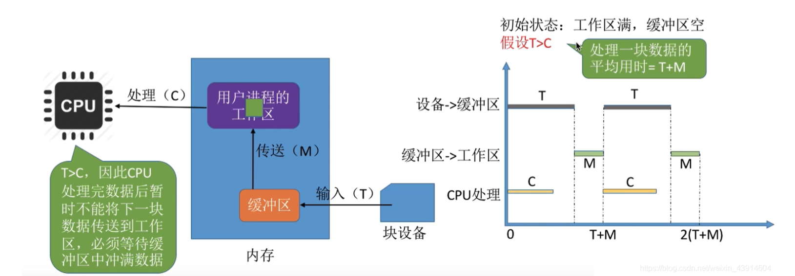

- T < C时

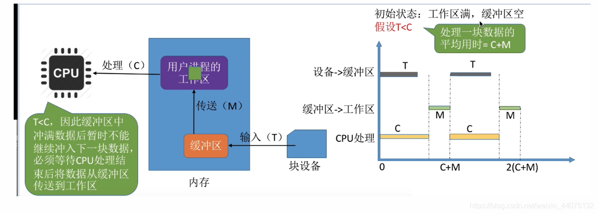

处理一个数据块的平均耗时为Max(T,C) + M。

3.双缓冲

操作系统会在主存中为其分配两个缓冲区。

处理一个数据块的平均耗时为Max (T, C+M)。

- 单缓冲：若两个相互通信的机器只设置单缓冲区，在任一时刻只能实现数据的单向传输。
- 双缓冲：若两个相互通信的机器设置双缓冲区，则同一时刻可以实现双向的数据传输。

管道通信中的“管道”其实就是缓冲区。要实现数据的双向传输，必须设置两个管道。

4.循环缓冲区

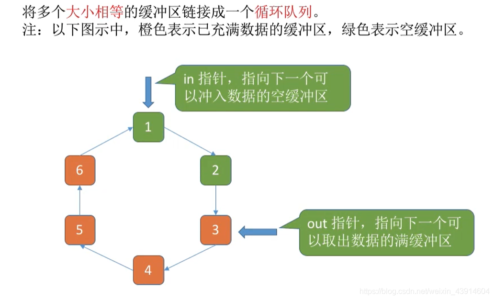

5.缓冲池

缓冲池由系统中共用的缓冲区组成。这些缓冲区按使用状况可以分为:

- 空缓冲队列
- 装满输入数据的缓冲队列(输入队列)
- 装满输出数据的缓冲队列(输出队列)

根据一个缓冲区在实际运算中扮演的功能不同，又设置了四种工作缓冲区:

- 用于收容输入数据的工作缓冲区(hin) 
- 用于提取输入数据的工作缓冲区(sin) 
- 用于收容输出数据的工作缓冲区(hout) 
- 用于提取输出数据的工作缓冲区(sout)

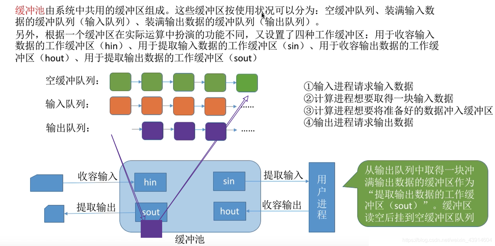
