### 一、概述

1.内存：内存可存放数据。程序执行前需要先放到内存中才能被CPU处理，为了缓和CPU与硬盘之间的速度矛盾。


2.程序如何运行：

````
x = x + 1;

//	  操作码   存取数字的目标地址 取数字原地址
指令1 (00101100,00000011,01001111)数据传送指令
    
指令2 (10010010,00000011,00000001 )加法指令
指令3 (00101100,01001111,00000011)数据传送指令
````

3.逻辑地址和相对地址：

编译时产生的指令只关心相对地址，实际放入内存中时再想办法根据起始位置得到绝对地址。

编译时只需确定变量x存放的相对地址是100(也就是说相对于进程在内存中的起始地址而言的地址)。

CPU想要找到x在内存中的实际存放位置，只需要用进程的起始地址+100即可。

相对地址又称逻辑地址，绝对地址又称物理地址。

4.运行程序的过程

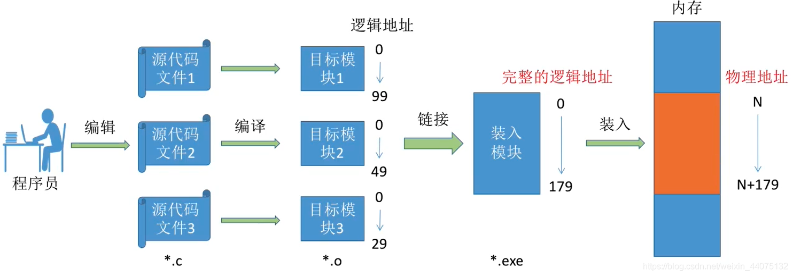

- 编译:由编译程序将用户源代码编译成若千个目标模块(编译就是把高级语言翻译为机器语言)。
- 链接:由链接程序将编译后形成的一组目标模块，以及所需库函数链接在一起，形成一个完整的装入模块。
- 装入(装载) :由装入程序将装入模块装入内存运行。 

5.装入过程

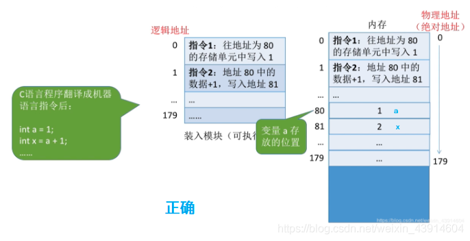

需要在装入的时候对地址做偏移操作。

- 绝对装入：在编译时，如果知道程序将放到内存中的哪个位置，编译程序将产生绝对地址的目标代码。
  装入程序按照装入模块中的地址，将程序和数据装入内存。绝对装入只适用于单道程序环境。
  
- 静态重定位：又称可重定位装入。编译、链接后的装入模块的地址都是从0开始的，指令中使用的地址、数据存放的地址都是相对于起始地址而言的逻辑地址。可根据内存的当前情况，将装入模块装入到内存的适当位置。装入时对地址进行 “重定位” ，将逻辑地址变换为物理地址(地址变换是在装入时一次完成的)。
  静态重定位的特点是在一个作业装入内存时，必须分配其要求的全部内存空间，如果没有足够的内存，就不能装入该作业。
  作业一旦进入内存后，在运行期间就不能再移动，也不能再申请内存空间。
  
- 动态重定位：动态重定位:又称动态运行时装入。编译、链接后的装入模块的地址都是从0开始的。装入程序把装入模块装入内存后，并不会立即把逻辑地址转换为物理地址，而是把地址转换推迟到程序真正要执行时才进行。
  因此装入内存后所有的地址依然是逻辑地址。这种方式需要一个重定位寄存器的支持。
  


动态重定位更加灵活，并且可将程序分配到不连续的存储区中;在程序运行前只需装入它的部分代码即可投入运行，然后在程序运行期间，根据需要动态申请分配内存;
便于程序段的共享，可以向用户提供一个比存储空间大得多的地址空间。

6.链接过程 

- 静态链接:在程序运行之前，先将各目标模块及它们所需的库函数连接成一个完整的可执行文件(装入模块) ,之后不再拆开。

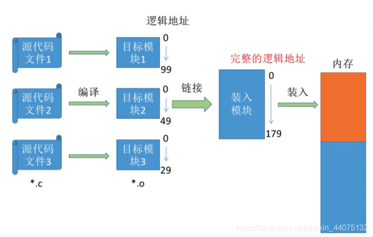

- 装入时动态链接:将各目标模块装入内存时，边装入边链接的链接方式。

- 运行时动态链接:在程序执行中需要该目标模块时，才对它进行链接。其优点是便于修改和更新，便于实现对目标模块的共享。


### 二、内存管理

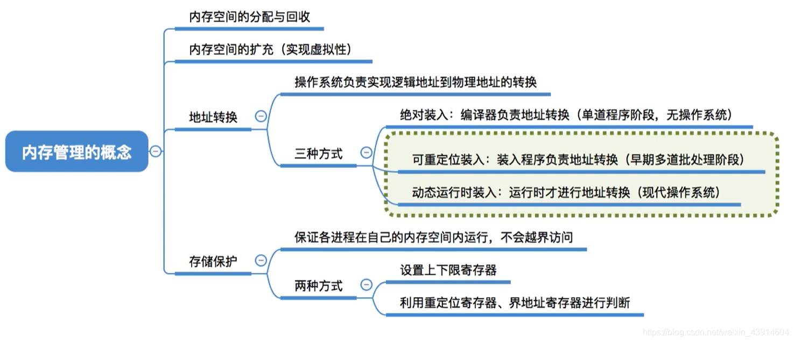

- 内存空间的分配和回收。
- 操作系统需要提供某种技术从逻辑上对内存空间进行扩充（虚拟存储）。
- 操作系统需要提供地址转换功能，负责程序的逻辑地址与物理地址的转换。
- 操作系统需要提供内存保护功能。保证各进程在各自存储空间内运行，互不干扰。

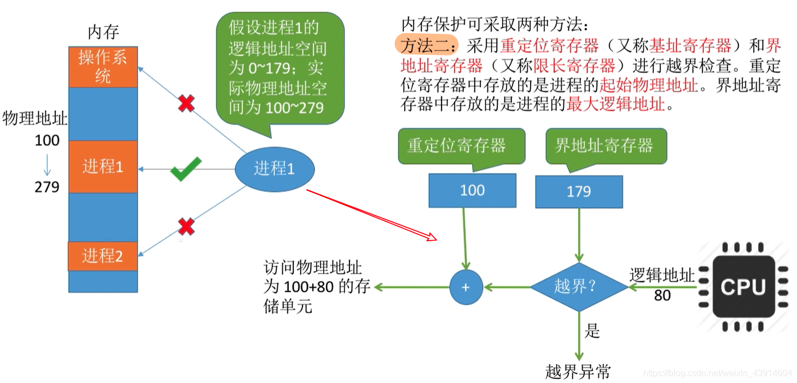


### 三、内存空间扩展


1.覆盖技术

将程序分为多个段(多个模块)。常用的段常驻内存，不常用的段在需要时调入内存。

内存中分为一个“固定区”和若干个“覆盖区”，需要常驻内存的段放在“固定区”中，调入后就不再调出(除非运行结束)。

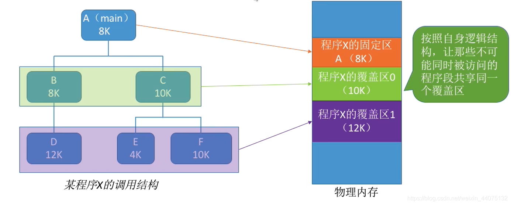
B和C共享覆盖区，D，E，F也共享覆盖区。

必须由程序员声明覆盖结构，操作系统完成自动覆盖。对用户不透明，增加了用户编程负担。覆盖技术只用于早期的操作系统中，现在已成为历史。

2.交换技术


交换技术的设计思想:内存空间紧张时，系统将内存中某些进程暂时换出外存，把外存中某些已具备运行条件的进程换入内存(进程在内存与磁盘间动态调度)。


### 四、内存空间的分配与回收

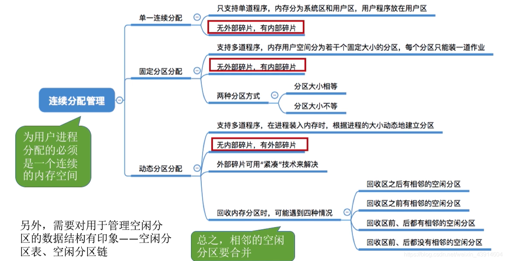

1.单一连续分配

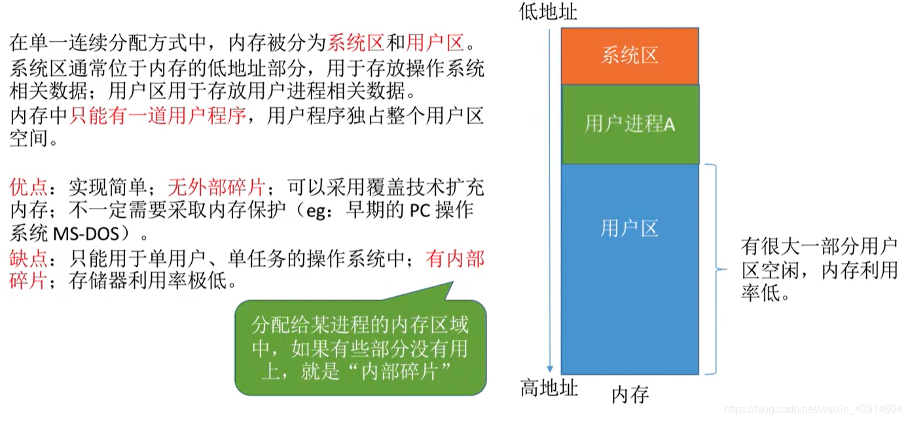

2.固定分区分配

20世纪60年代出现了支持多道程序的系统，为了能在内存中装入多道程序，且这些程序之间又不会相互干扰，
于是将整个用户空间划分为若千个固定大小的分区，在每个分区中只装入一道作业，这样就形成了最早的、最简单的一种可运行多道程序的内存管理方式。

- 分区大小相等

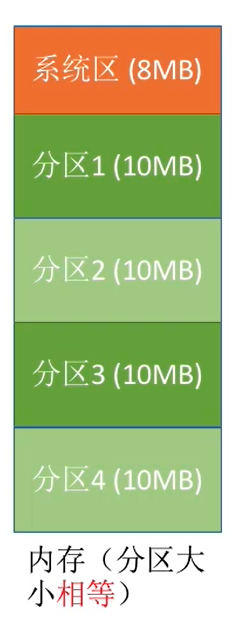

- 分区大小不等

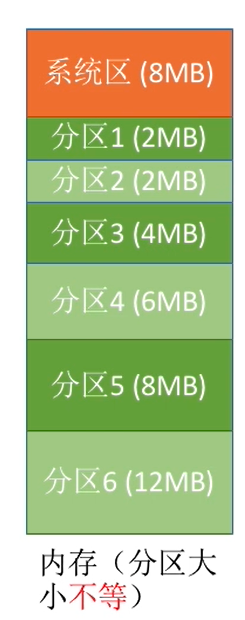

增加了灵活性，可以满足不同大小的进程需求。根据常在系统中运行的作业大小情况进行划分(比如:划分多个小分区、适量中等分区、少量大分区)。

操作系统通过分区说明表来实现各个分区的分配与回收。

每个表项对应一个分区，通常按分区大小排列。每个表项包括对应分区的大小、起始地址、状态(是否已分配)。


但当用户程序太大时，可能所有的分区都不能满足需求，此时不得不采用覆盖技术来解决，但这又会降低性能。依然会产生内部碎片。

- 动态分区分配

动态分区分配又称为可变分区分配。这种分配方式不会预先划分内存分区，而是在进程装入内存时，根据进程的大小动态地建立分区，并使分区的大小正好适合进程的需要。因此系统分区的大小和数目是可变的。


系统要用怎样的数据结构记录内存的使用情况？

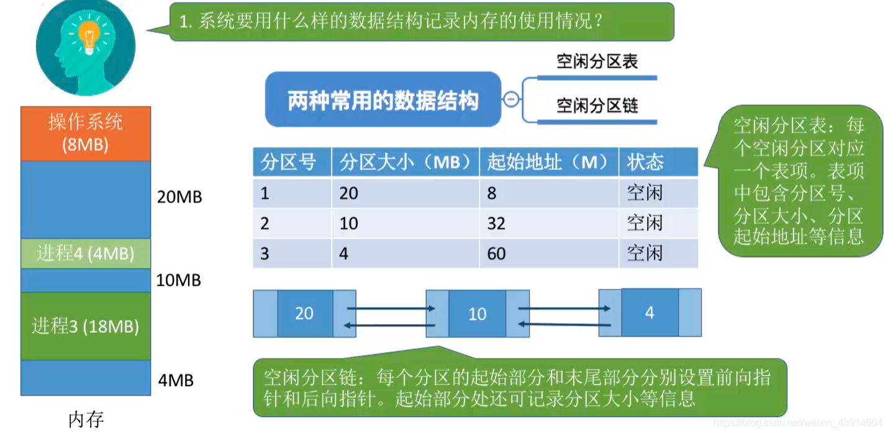

当多个空闲分区都能满足要求时，应该选择哪个分区进行分配？


如何进行分区的分配和回收操作？

- 如果所需要空间大小小于某一分区，分配之后改变该分区的起始地址。
- 如果所需要空间等于某一分区大小，分配之后在表项中删除该分区。

- 回收时，如果分区前后有空闲空间，那么合并两个区或三个区
- 如果回收后，前后都没有空闲空间，那么表项中多增加一个。

各表项的顺序不一定按地址递增，具体根据动态分区算分配。

3.内外部碎片 

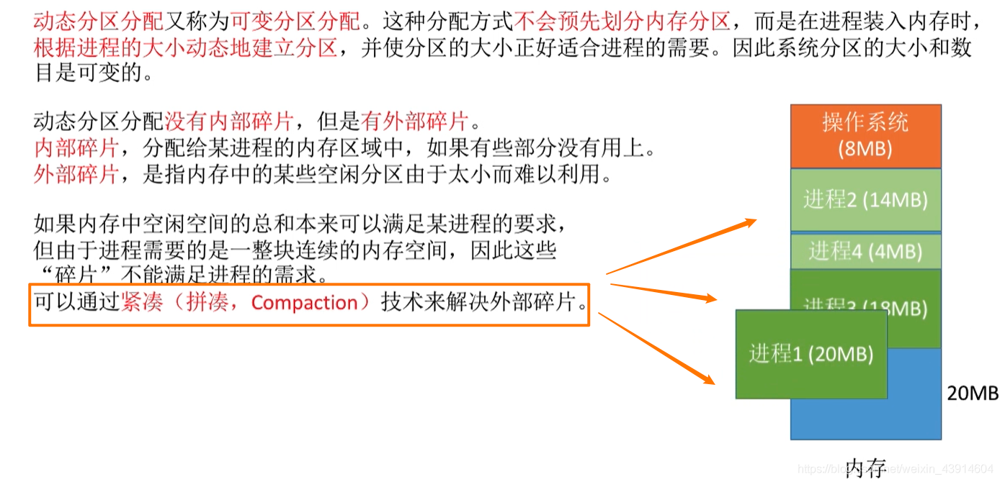

### 四、动态分区分配的四种算法

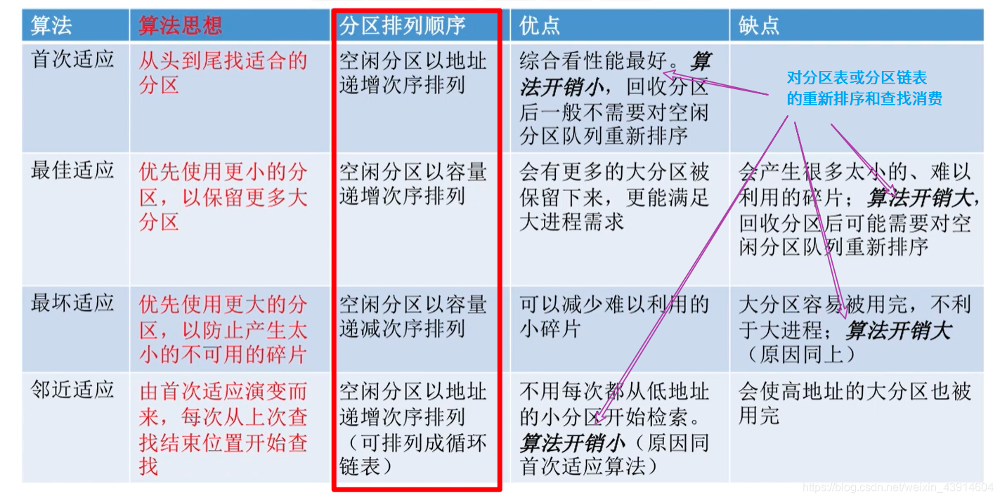

1.首次适应算法


2.最佳适应算法

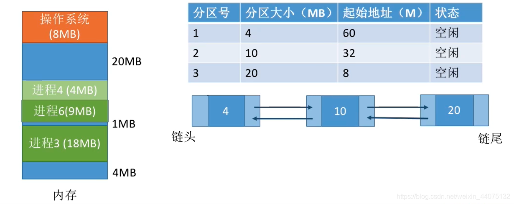
保证当大进程到来时能有连续的大片空间，可以尽可能多地留下大片的空闲区，即，优先使用更小的空闲区。

空闲分区按容量递增次序链接。每次分配内存时顺序查找空闲分区链( 或空闲分区表)，找到大小能满足要求的第一个空闲分区。

缺点:每次都选最小的分区进行分配，会留下越来越多的、很小的、难以利用的内存块。因此这种方法会产生很多的外部碎片。

3.最坏（大）适应算法

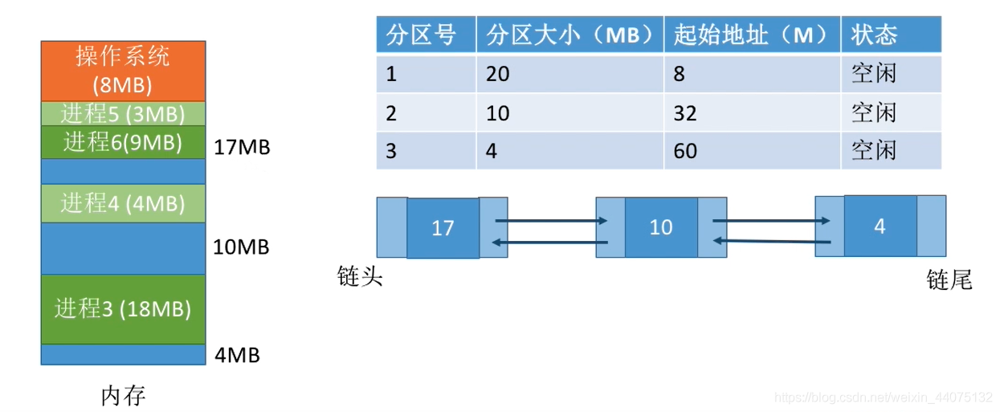
为了解决最佳适应算法的问题—即留下太多难以利用的小碎片，可以在每次分配时优先使用最大的连续空闲区。

空闲分区按容量递减次序链接。每次分配内存时顺序查找空闲分区链(或空闲分区表)，找到大小能满足要求的第-一个空闲分区。

缺点:每次都选最大的分区进行分配，虽然可以让分配后留下的空闲区更大，更可用，但是这种方式会导致较大的连续空闲区被迅速用完。如果之后有大进程到达，就没有内存分区可用了。

4.临近适应算法

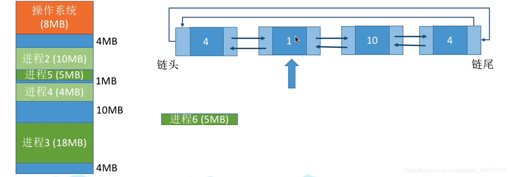

首次适应算法每次都从链头开始查找的。这可能会导致低地址部分出现很多小的空闲分区，而每次分配查找时，都要经过这些分区，因此也增加了查找的开销。如果每次都从上次查找结束的位置开始检索，就能解决上述问题。

空闲分区以地址递增的顺序排列(可排成一个循环链表)。每次分配内存时从上次查找结束的位置开始查找空闲分区链(或空闲分区表)，找到大小能满足要求的第一个空闲分区。

首次适应算法每次都要从头查找，每次都需要检索低地址的小分区。但是这种规则也决定了当低地址部分有更小的分区可以满足需求时，会更有可能用到低地址部分的小分区，也会更有可能把高地址部分的大分区保留下来(最佳适应算法的优点)。

邻近适应算法的规则可能会导致无论低地址、高地址部分的空闲分区都有相同的概率被使用，也就导致了高地址部分的大分区更可能被使用，划分为小分区，最后导致无大分区可用(最大适应算法的缺点)。

### 四、非连续分配管理方式-分页存储

非连续分配管理方式：如果允许将一个进程分散地装入到许多不相邻的分区中，便可充分地利用内存，而无需再进行紧凑。

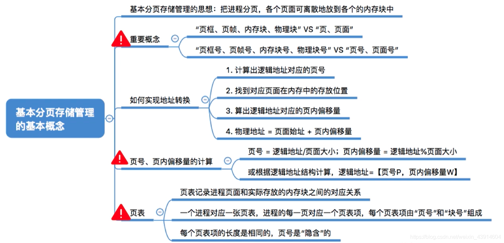

1.基本概念

将内存空间分为一个个大小相等的分区( 比如:每个分区4KB)，每个分区就是一个“页框”，或称“页帧”、“内存块”、“物理块”。每个页框有一个编号，即“页框号”(或者“内存块号”、“页帧号”、“物理块号”)页框号从0开始。

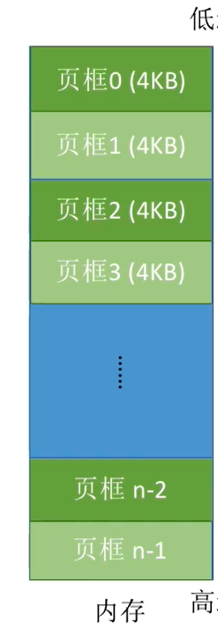

将用户进程的地址空间也分为与页框大小相等的一个个区域，称为“页”或“页面”。每个页面也有一个编号，即‘页号”,页号也是从0开始。


注:进程的最后一个页面可能没有一个页框那么大。因此，页框不能太大，否则可能产生过大的内部碎片。

各个页面不必连续存放，也不必按先后顺序来，可以放到不相邻的各个页框中。

2.地址转换

从动态重定位的思想到地址转换。


每个页的大小固定，起始位置对应到不同的内存物理地址，通过偏移可以找到逻辑地址对应的物理地址。

计算页号和偏移量：

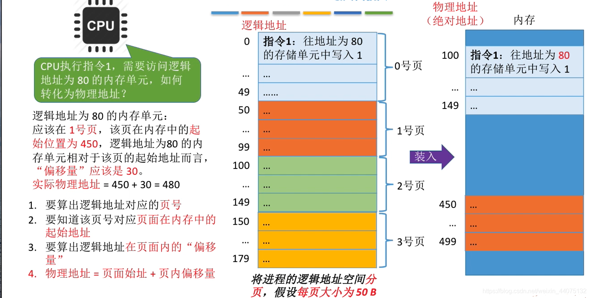

为了方便计算页号、页内偏移量，页面大小一般设为2的整数幂：

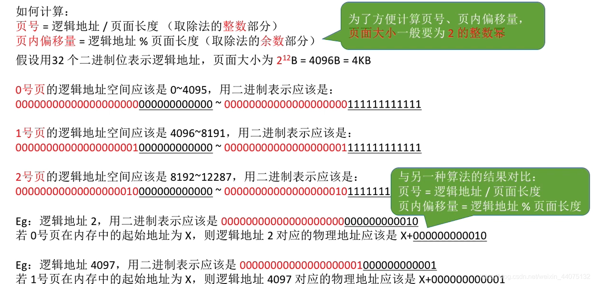


M位表示“页号”，则说明在该系统中，一个进程最多允许有2M个页面。

K位表示“页内偏移量”，则说明该系统中一个页面的大小是2K个内存单元。

3.页表

为了能知道进程的每个页面在内存中存放的位置，操作系统要为每个进程建立一张页表。

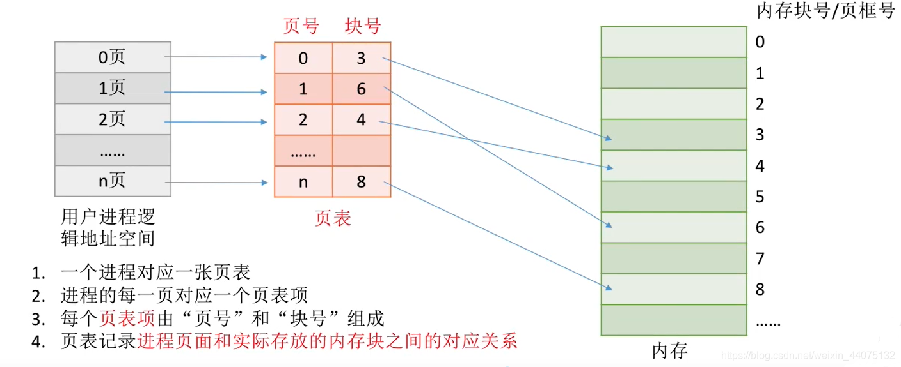

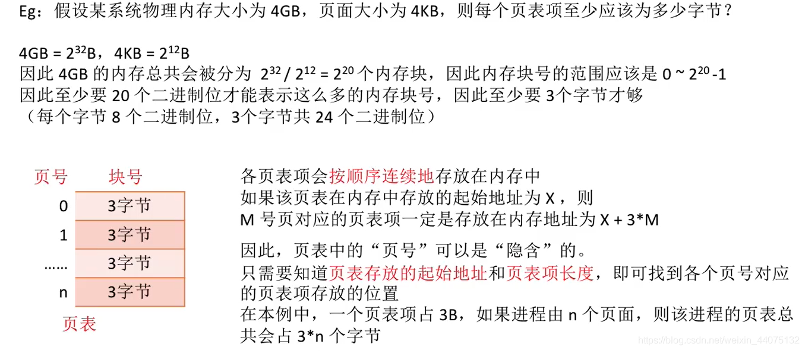


