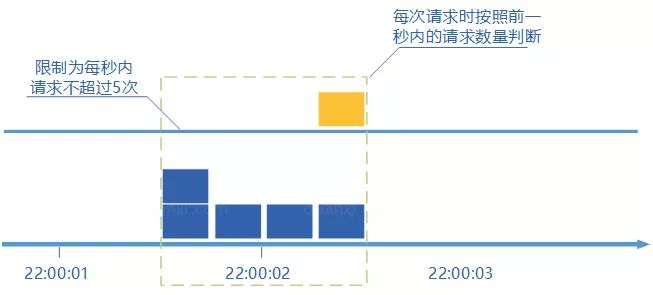
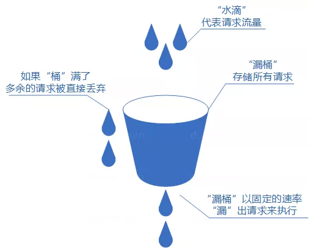

###网关的作用

现代微服务架构下，一个大项目通常被拆分为多个服务，但是像鉴权，流量控制，监控日志等功能，这一类非业务的功能确实每个服务都需要的，
于是出现一个统一的入口做这些功能的处理。

####统一监控 
网关作为系统和外部联通的出入口，这里就可以记录请求报文，响应报文，链路时间等从而监控服务。

####鉴权，安全认证

对于一个外部用户，可以网关层鉴权判断用户可以访问哪些服务，不能访问哪些服务。

####请求路由，服务泛化

某些服务升级的场景，新老服务混用的情况下，可以网关做到api维度甚至用户维度的访问控制。
而内部如果出现不同服务请求协议不同的情况下，也可以用网关层做协议的转化，甚至实现的自己的统一协议，对外仍然暴露的是相同协议的请求接口。

####请求限流

限流(Ratelimiting)指对应用服务的请求进行限制，例如某一接口的请求限制为 100 个每秒,对超过限制的请求则进行快速失败或丢弃。
不同服务的承受能力可能不同，可以在网关上对不同服务做指定的限制。

常用的限流算法如下：

1.固定窗口计数器算法

- 将时间划分为多个窗口。
- 在每个窗口内每有一次请求就将计数器加一。
- 如果计数器超过了限制数量，则本窗口内所有的请求都被丢弃当时间到达下一个窗口时，计数器重置。

固定窗口法的实现最简单，但是会有严重的临界问题，如某接口的qps为100，前一秒的最后200ms承受了90次请求，
而下一秒的前200ms也承受了90次请求，这个情况并没有违反窗口算法，但实际上在400ms之内承受了180次请求，超过的承受能力。

2.滑动窗口计数器算法

- 将时间分为多个周期
- 分别记录每个周期内访问次数，并且根据是时间滑动删除过期的小周期

如之前的例子，可以将1s分为5个小周期，0-1s的总承受量为100，而0.8s到1.8s
的总承受量也为100，也即不会在1-1.2秒只能再接受多余的请求。滑动窗口算法解决了固定窗口的临界问题，且滑动窗口的划分越多，限流统计就越准确。

3.漏桶算法

- 桶的容量是固定的,并且水流以一个固定的速率流出。
- 流入的水流可以是任意速率。
- 如果流入的水流超出了桶的容量，则后续流入的水流溢出(请求被丢弃)。
- 如果桶内没有水,则不需要流出。

一般会有一个队列来保存请求，另有一个线程按固定速率从队列中获取请求执行，漏桶算法无法解决短时间内的突发流量。

4.令牌桶算法

- 桶用于存放令牌，并且程序以一定速率生成令牌放入桶中。
- 每个请求执行时需要拿一个令牌才可以被通过。
- 如果没有令牌了，那么触发限流策略。

令牌桶算法对于突发的流量情况进行了改进，比如桶中有200个令牌，那么相当于可以应对一次短时间200次请求的突发流量。

***
分布式应用环境下，通常使用redis + lua脚本实现以上限流算法，本质是将限流服务原子化，
即使用lua脚本将判断请求数量和操作请求数+1或者限流返回作为一个原子操作。

