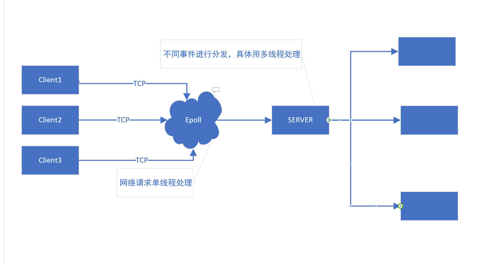

### 1.redis和其他

Redis是一种NOSQL数据库，包含多种数据结构，支持网络，基于内存，可选持久化的键值对数据库。
- 基于内存运行，性能高效
- 支持分布式，理论上可以无限扩展
- key-value存储系统

通常因为性能高效，使用方便而作为缓存中间件

### 2.redis的高速

- redis的所有数据都存储在内存中，纯粹的内存操作
- 使用单线程模式省去上下文切换和锁相关的消耗从而达到一个极高的读取速度。
- 在网络方面，redis使用多路复用IO模型达到大吞吐量，即多个客户端开启多个TCP连接，而服务端只使用一个epoll线程来接受事件（典型的事件驱动模型）

单线程+内存操作+多路复用+数据结构优化

注意：redis本身由于单线程的模型是线程安全的，但是业务层多个线程操作redis时依然需要锁（原子操作不代表线程安全），。为业务系统并不是线程安全的

注2：redis4.0后在删除操作上加入了多线程，redis6.0之后在网络读写上加入了多线程，在redis.conf中使用io-threads-do-reads yes开启

所以redis的瓶颈通常不在CPU，而在内存和网络上

### 3.redis数据类型

- string
- list
- set
- zset
- hash

阿里内部使用加强版redis，Tair，tair除了上述的数据结构，还有一些加强型，TairString，TairHash，TairBloom，这些数据结构中加入一些版本控制和边界值。

### 4.淘汰策略

内存不足时数据淘汰模式：
- no-enviction：默认策略，禁止驱逐数据，内存不足时，写入数据会报错。
- volatile-lru：设置过期时间中最近最少使用的数据。
- allkeys-lru：全集数据中最近最少使用的数据。
- volatile-lfu：设置过期时间中使用频率最低的数据。
- allkeys-lfu：全集数据中使用频率最低的数据。
- volatile-random：设置过期数据中随机淘汰。
- allkeys-random：全集数据中随机淘汰。
- volatile-ttl：设置过期时间中即将过期的数据。

通常泛用的模式是lru，如果不确定数据使用频率，那么可以使用allkeys-lru，这样不需要设置过期时间，省去expire额外消耗的内存，也可以一定程度提升性能。

如果所有key的使用频率接近，那么可以使用random模式。

---
淘汰策略分为主动淘汰和被动淘汰

主动淘汰：使用get，hget等命令时会检查expire参数，如果过期则删除，不额外消耗CPU资源，但是失效数据会占用额外内存。

被动淘汰：redis会周期性运行任务，在设置expire的key中随机检查，过期的数据会及时删除，但是需要额外消耗CPU资源

另：Tair的中一些数据结构，如TairHash，在插入数据时会按过期时间用最小堆排序，这样主动淘汰时会按顺序检查，效率相对随机查找高，当然也要付出一部分内存去维护堆的排序。

---

在具体的业务中，数据量大，快速更新的数据可以使用主动淘汰，尽快的释放内存空间。
相反数据不太更新可以使用被动淘汰节省CPU资源。如果对不同数据的使用频率比较了解，也可以混合使用，热点数据使用被动淘汰，其他使用主动淘汰。