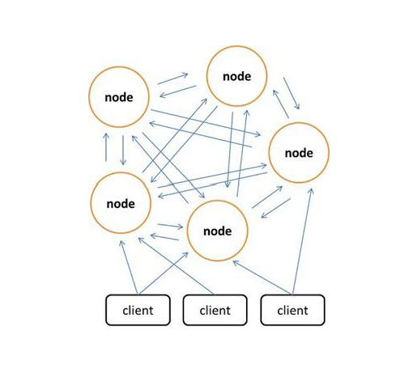
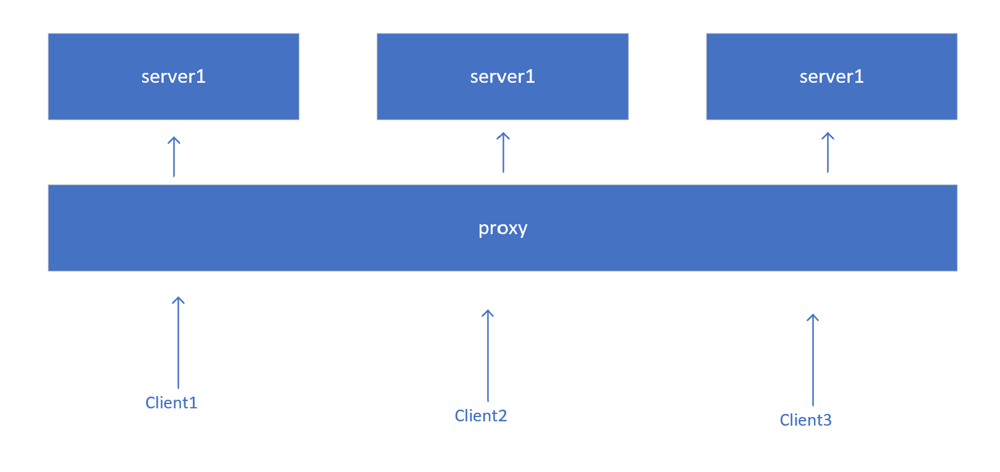

### 1.redis主从

主从概念：主从是一种数据备份的方案，使用两个或两个以上相同的数据库，将一个数据库当做主数据库，而另一个数据库当做从数据库。在主数据库中进行相应操作时，从数据库记录下所有主数据库的操作，使其二者一模一样。
redis本身就支持主从架构，修改配置文件中slaveof即可。

主从的同步过程分两种：
- 全量同步：
    1. master发起SYNC命令，开始执行bgsave生成RDB文件
    2. 快照文件生成后，向所有从服务器发送，同时自身也可以继续执行写命令
    3. 从服务器收到快照，并执行写入缓存中
    
- 增量同步：
    1. 主服务器每执行一个写指令就向从服务器发送相同的写指令
    2. 从服务器接受并执行收到的写命令
    
通常在主从刚刚建立连接时，进行全量同步，之后的写操作，则进行增量同步，如果增量同步多次不成功，slave也可以随时发起全量同步。

一个master可以同时有多个从服务器，从服务器还可以有从服务器，形成树状结构。

### 2.哨兵

哨兵是一个监控redis系统运行情况的独立进程，用于实现自动化的主从切换。

哨兵监控开启后，会不断检查Master和Slave是否正常运行，当某个节点出现问题时，哨兵会自动开始迁移故障，将其中一个slave升级为master，也具有一些发送通知的能力

### 3.redis集群

集群：提供相同能力的多个实例，形成一个逻辑上的整体，将数据切分到多个实例中，横向拓展突破单点极限。

redis自带的集群功能采用无中心化处理，每个实例都具有转发的功能，对于的数据的切分采用一致性hash算法。

注：使用一致性hash算法，相比普通的hash算法，动态添加和删除的节点的性能更高。

在Tair中使用高性能代理来实现转发：

