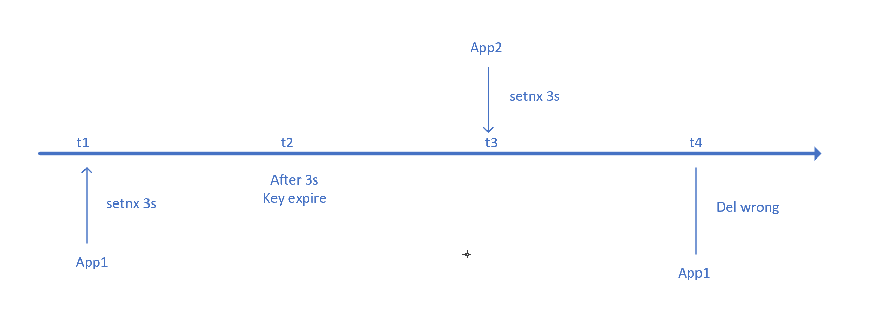

### 1.分布式锁

- 在单机的统中，当存在多个线程可以同时改变某个变量（可变共享变量）时，就需要对变量或代码块做同步，即设立一个竞态条件，使得这个变量在某一时间只有一个线程可以访问。

- 而在分布式集群环境下，服务分布在不同机器上，这时候就需要一种跨机器的互斥机制来控制共享资源的访问，这种机制被称为分布式锁。

### 2.分布式锁的特征

- 在分布式系统环境下，一个方法在同一时间只能被一个机器的一个线程执行；
- 高可用的获取锁与释放锁
- 高性能的获取锁与释放锁
- 具备可重入特性
- 具备锁失效机制，防止死锁
- 具备非阻塞锁特性，即没有获取到锁将直接返回获取锁失败

而redis的SETNX指令就可以满足作为分布式锁的条件

### 3.redis的实现

- set key val NX EX time：当且仅当key不存在时，set一个key-value值，并且设置一个time，超过这个时间会自动释放key，避免死锁。如果key存在，直接返回0
- delete key：删除key

实现思路为获取锁的时候，使用set NX EX加锁，这段时间内其他的服务访问行为都无法获取锁，直到当前服务执行完成，使用delete释放锁，其他服务可以尝试获取锁。

简易的分布式锁的问题：

超时解锁人不一致问题
1. t1 app1获取锁 时间为3s
2. app1 3s内业务未执行完成，t2自动释放锁
3. t3时刻 app2获取锁
4. app1执行完成，t4将app2的锁删除

这里就引起了app1将app2锁删除的问题，最后导致不可预知的问题。

### 4.加强版实现

上述问题的解决需要验证加锁人和解锁人的一致性，所以可以将val作为身份验证信息
````
if redis.call("get",KEY) == VAL then
    return redis.call("del",KEY)
else
    return 0
````
即在删除之前，获取key的value来确认锁是不是自己加的，这里需要保证不同的服务产生的val不一致，且需要记录这个val。

这里使用rua脚本是保证get和delete操作的原子性。

在Tair中有新的CAS和CAD指令，即是CAS算法（Compare and Swap）的实现

- CAD <key> <value>：当oldvalue和value相等时，删除key
- CAS <key> <oldvalue> <newvalue>：当oldvalue和value相等时，设置新的value

CAD指令可以很方便地替代上述rua脚本的过程，而CAS可以用于延长锁的时间。

### 5.集群模式下的分布式锁

当单节点的redis升级为集群之后，当某一客户端写入锁之后，还未等到同步到其他节点，master节点突然不可用并发切换，这个切换过程中如果节点数据没有做持久化，那么这个环境，这把锁就丢失了，违反了互斥性。

####redlock算法

````
假设5个实例，某一client获取锁时，或进行如下操作

1、得到当前的时间，微秒单位

2、尝试顺序地在 5 个实例上申请锁，当然需要使用相同的 key 和 random value，这里一个 client 需要合理设置与 master 节点沟通的 timeout 大小，避免长时间和一个 fail 了的节点浪费时间

3、当 client 在大于等于 3 个 master 上成功申请到锁的时候，且它会计算申请锁消耗了多少时间，这部分消耗的时间采用获得锁的当下时间减去第一步获得的时间戳得到，如果锁的持续时长（lock validity time）比流逝的时间多的话，那么锁就真正获取到了。

4、如果锁申请到了，那么锁真正的 lock validity time 应该是 origin（lock validity time） - 申请锁期间流逝的时间

5、如果 client 申请锁失败了，那么它就会在少部分申请成功锁的 master 节点上执行释放锁的操作，重置状态
````
redlock本质上是通过增加redis实例数量来降低锁丢失的概率，显然实例数量越多，丢失概率越低。

redlock最大问题在于需要创建多个独立的redis实例来保障锁的不丢失

####wait指令实现
````
set key val NX EX time
wait 1 3000
````
wait指令只会阻塞当前客户端，客户端需要阻塞到写入命令从master同步到一定数量的slave才返回，设置最大等待时间为3000ms。
如果在等待过程中发生故障主从切换，那么wait会返回err，表示加锁过程可能失败，需要重新处理。相比redlock，这种模式的成本更低。
